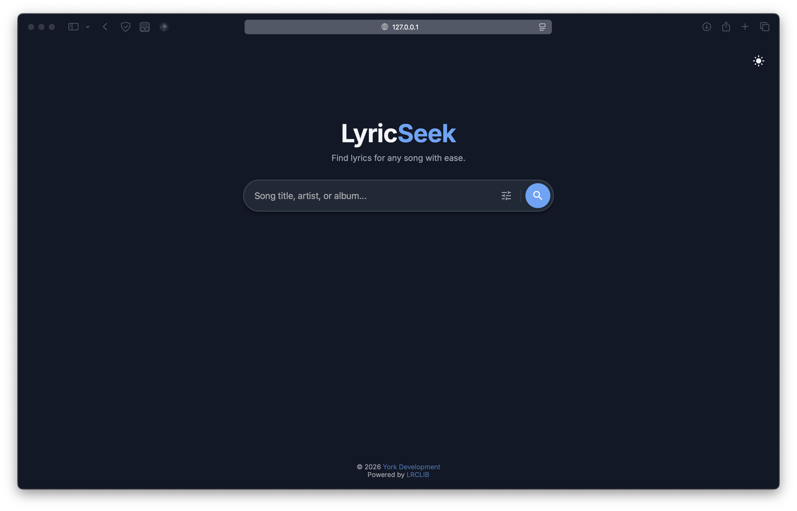
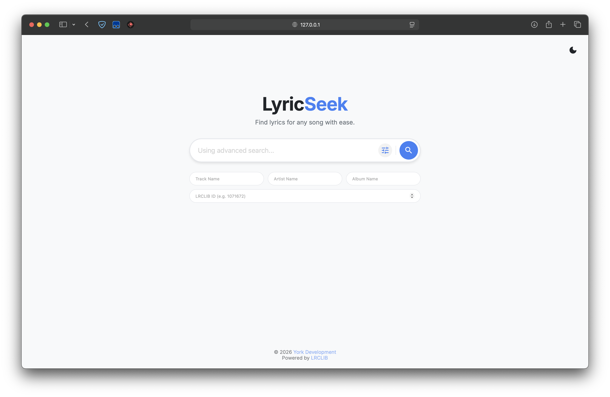
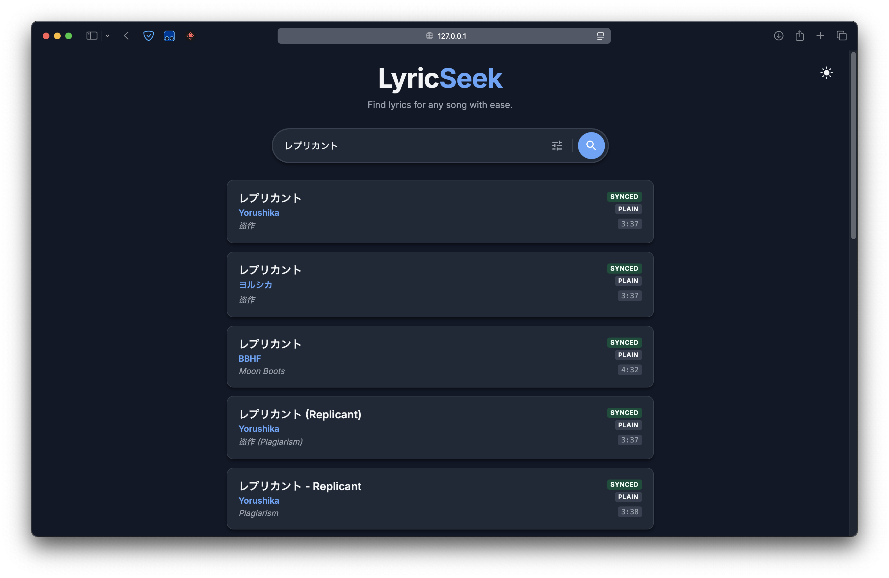
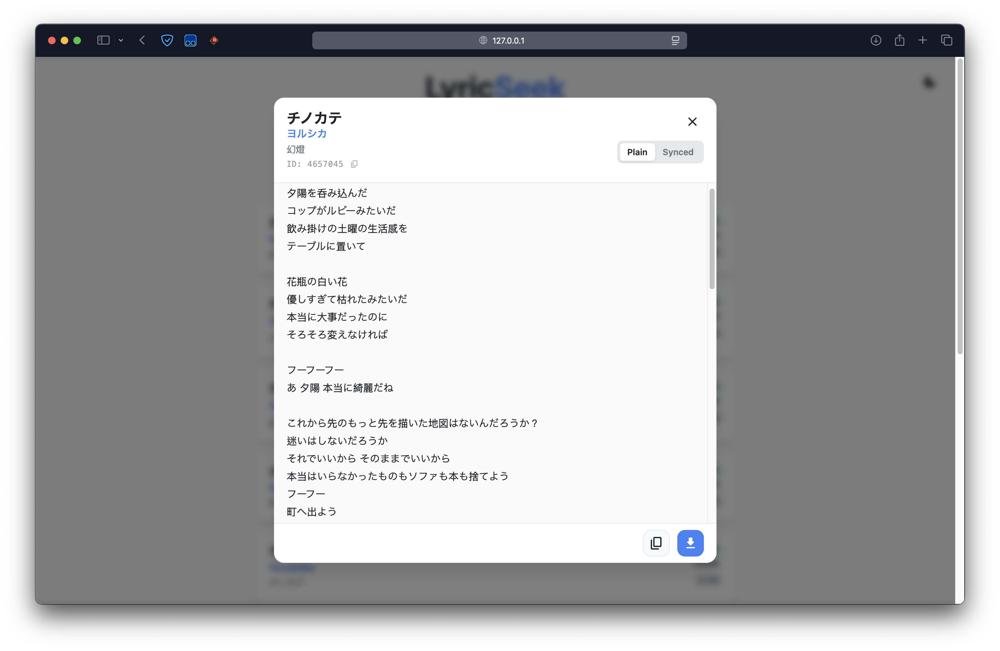

  
  
    
  </a>
  
  

## Overview

LyricSeek is a lightweight web app for searching and viewing song lyrics quickly.

## Features

- Fast lyric lookup
- Clean, responsive UI
- Simple, no-install usage

## Getting Started

Simply open **https://york9675.github.io/LyricSeek/** in your web browser to start using LyricSeek.

**OR**

1. Clone or download this repo.
2. Open index.html in your browser.

## Usage

1. Enter the song title, artist or album...
2. Run the search to fetch lyrics.
3. Read / copy or download the results.

## Credits

Lyrics data provided by [LRCLIB](https://lrclib.net/).

## Screenshots

> [!NOTE]  
> Screenshots may not be up to date with the latest version and vary based on device and browser.

**Home Screen**

**Advanced Search**

**Search Results**

**Lyrics View**

## Bug report / Feedback

If you encounter any problems during use or have feedback, please create issues to report.

## Contribution

Feel free to contribute to this project by creating issues, submitting pull requests, or improving documentation.

## License

This project is licensed under the MIT License. See the LICENSE file for more details.

## Support

When I began developing apps, my mission was simple: to create genuinely helpful tools and offer them for free. In a world saturated with paid features and ads, I aimed to build something that anyone could use without cost, simply to make life a little easier. My apps have always been ad-free, and some, like this project, are open-source. If my work can help even a small group of people become more efficient or solve a problem, it’s worth it.

### How You Can Help

If you believe in this project and would like to support its growth, here are a few ways you can contribute:

- **Donate:** Any amount, large or small, will encourage me a lot. You can sponsor the project via [Buy Me a Coffee](https://buymeacoffee.com/york0524) using the button below!
- **Spread the Word:** Share this project with your network—friends, family, or anyone who might benefit from or support it!
- **Collaborate:** If you’re a developer, designer, or have ideas for improvement, feel free to contribute to the project by creating issues, submitting pull requests, or improving documentation!

Your support, in any form, will help unlock the full potential of this app and keep it free for everyone. Thank you for helping keep this vision alive!

 

Or, you can simply give the project a :star:!

_Thank you for taking the time to read and for any support you can offer. Together, we can improve this app and help more people!_

## Star History

***

© 2025 York Development

Made with :heart: in Taiwan.